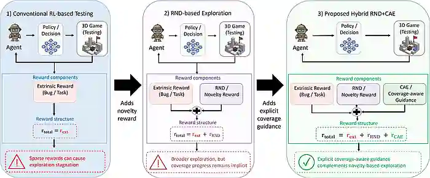
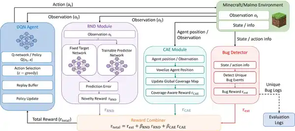
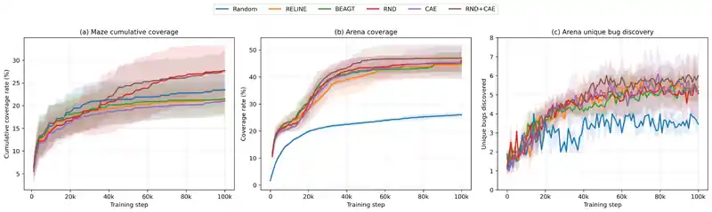

# Coverage-Aware Guidance for Novelty-Driven Exploration (RND+CAE)

**Automated Game Testing in Sparse-Reward 3D Environments**  
Minecraft / Project Malmo · DQN · Random Network Distillation · Coverage-Guided Adaptive Exploration

This repository contains the research implementation for combining **novelty-driven exploration** with **coverage-aware guidance** in reinforcement-learning-based automated game testing.

The final experiment source update (2026-09-15) adds the unified Maze and
Issue-10 Arena trainers, the coverage-logging Random baseline, and the Arena
Spatial/NoStag ablations. These files are copied from the experiment workspace;
the earlier individual agent scripts remain available as historical versions.

## Motivation

In sparse-reward 3D environments, RL agents can become concentrated on a small subset of trajectories and interactions. RND provides a novelty signal, but novelty alone does not always encourage systematic coverage of task-relevant states and interactions.

This work introduces **Coverage-Guided Adaptive Exploration (CAE)** and combines it with RND to encourage broader, more structured exploration.



*Conceptual progression from conventional task-reward-driven testing to RND-based exploration and the proposed hybrid RND+CAE approach.*

## Method

The agent is trained with a reward composed of the external task reward and intrinsic exploration signals:

- **RND novelty reward** — predictor-target prediction error
- **CAE coverage reward** — visit-count-based coverage guidance and stagnation recovery

The combined intrinsic signal is integrated with the external reward before the DQN update.



*System architecture used to combine DQN, RND novelty, CAE coverage guidance, and fault logging in Project Malmo.*

## Environments

The experiments use **Project Malmo / Minecraft** with two complementary settings.

### Randomized Maze
Used to evaluate spatial exploration and cumulative coverage.

### Partitioned Arena
Used to evaluate interaction-driven exploration and seeded-fault discovery.

The Arena configuration includes structured observations such as position/orientation, voxel information, and inventory state, together with a larger discrete action space.

## Evaluation



*Training-time coverage and unique-fault discovery trends for the main comparison methods.*

Experiments were conducted under the same training budget with repeated runs and multi-seed evaluation.

Arena values as reported in the article (not recomputed by this source update):

| Method | Final Unique Bugs | Bug Discovery AUC |
|---|---:|---:|
| Random | 3.50 ± 0.53 | 3.10 ± 0.53 |
| RELINE | 5.50 ± 0.97 | 4.27 ± 0.54 |
| BEAGT | 4.80 ± 1.81 | 4.20 ± 0.47 |
| RND | 4.70 ± 1.95 | 4.30 ± 0.64 |
| CAE | 5.20 ± 1.40 | 4.23 ± 0.79 |
| **RND+CAE** | **5.70 ± 1.06** | **4.66 ± 0.67** |

The evaluation also includes Maze coverage, repeated runs, ablation studies, and fault-discovery analysis.

## Repository Structure

```text
coverageguidedexploration/
|-- assets/
|   |-- rnd_cae_overview.webp
|   |-- rnd_cae_architecture.webp
|   `-- rnd_cae_results.webp
|-- malmo_bug_project/
|   |-- agents/
|   |   |-- train_maze_reexperiment.py
|   |   |-- train_arena_issue10_final.py
|   |   `-- train_random_arena_issue10_with_coverage_v2.py
|   |-- envs/
|   |   |-- simple_voxel_maze_env_v3.py
|   |   |-- maze_reward_wrappers.py
|   |   |-- malmo_env_issue10_distributed_ep90.py
|   |   |-- bug_detector_issue10_consistent.py
|   |   |-- bug_definitions_issue10_consistent.json
|   |   `-- bug_targets_issue10.py
|   |-- missions/bug_mission_issue10_distributed_ep90.xml
|   |-- analyze_maze_reexperiment.py
|   |-- analyze_arena_ablation.py
|   |-- test_arena_ablation_wrappers.py
|   `-- arena_ablation_runbook.md
|-- requirements-ubuntu20.txt
`-- README.md
```

The tree lists the final entry points and their dependencies. `Maze_RL.py`,
`Maze_BEAGT.py`, `Maze_CAE.py`, `train_RELINE.py`, `train_BEAGT.py`, and
`train_CAE.py` are legacy entry points. Experiment logs, checkpoints, Minecraft
binaries, and manuscript files are not included in this source update.

## My Contribution

My contribution to this work included:

- building the randomized Maze and Arena benchmarks in Project Malmo,
- implementing interaction-based seeded-fault logging,
- building the DQN/RND training pipeline,
- designing and integrating CAE reward signals,
- conducting multi-seed comparisons and ablation studies,
- evaluating coverage and fault-discovery behavior.

## Environment Setup

**Tested OS:** Ubuntu 20.04.6 LTS

The final experiment workspace used Python 3.8. The package versions recovered
from that workspace are listed in `requirements-ubuntu20.txt`; this is a direct
dependency snapshot, not a complete lockfile or a guarantee of identical runs.

### 1. Install Project Malmo

Follow the official Project Malmo setup instructions:

https://github.com/microsoft/malmo

Use a Python interpreter compatible with your Malmo native bindings. Confirm
that `python3 -c "import MalmoPython"` succeeds. `MalmoPython` and the Minecraft
client come from Project Malmo, not from the requirements file. Newer
operating-system or dependency versions may require compatibility fixes.

From the repository root, install the Python dependencies in the environment
used for Malmo:

```bash
python3 -m pip install -r requirements-ubuntu20.txt
```

### 2. Place the project directory

Move `malmo_bug_project` into your Malmo installation directory, then navigate to it.

```bash
cd MalmoPlatform/malmo_bug_project
```

### 3. Start a Malmo client

In a separate terminal, from the Malmo `Minecraft` directory:

```bash
./launchClient.sh -port 10000
```

Use a separate client port for every concurrent trainer. The following commands
run from `MalmoPlatform/malmo_bug_project`; module invocation keeps the local
`agents` and `envs` imports on the Python path.

### 4. Run the final Maze experiments

```bash
python3 -m agents.train_maze_reexperiment \
  --algo all --runs 50 --steps 100000 --port 10000 \
  --log-root ./logs_maze_reexperiment_50
```

Supported conditions are `RANDOM`, `RELINE`, `BEAGT`, `DQN_RND`, `CAE_FINAL`,
and `RND_CAE_FINAL`. `--algo all` executes them sequentially. The archived
trainer derives run seeds from the base `--seed`, run index, and algorithm
index; record the generated seeds when comparing run sets.

### 5. Run the final Arena experiments

```bash
python3 -m agents.train_arena_issue10_final \
  --algo RND_CAE_FINAL --seeds 1,2,3,4,5,6,7,8,9,10 \
  --steps 100000 --port 10000 \
  --log-root ./logs_arena_issue10_final --split-log-by-algo
```

The same trainer supports the six main conditions. `--algo all` selects the
main conditions; ablations are selected separately. For the Random baseline
with geometric coverage and position logging, use its dedicated final runner:

```bash
python3 -m agents.train_random_arena_issue10_with_coverage_v2 \
  --runs 10 --steps 100000 --port 10000 \
  --log-root ./logs_arena_issue10_final/RANDOM
```

### 6. Run the Arena ablations

```bash
python3 -m agents.train_arena_issue10_final \
  --algo ablations --seeds 1,2,3,4,5,6,7,8,9,10 \
  --steps 100000 --port 10000 \
  --log-root ./logs_arena_ablation --split-log-by-algo
```

`RND_CAE_SPATIAL` keeps the direct geometric cell key with weight `0.405` and
stagnation recovery. `RND_CAE_NO_STAG` retains the Full keys and weights while
disabling recovery. The Full condition is `RND_CAE_FINAL`.

The [Arena ablation runbook](malmo_bug_project/arena_ablation_runbook.md)
describes the five-client schedule. Run Full and both ablations with the same
explicit seed list for a new paired experiment. Retain completed runs and
rerun infrastructure failures with the same seed; a failed mission start is
not a zero-discovery result.

### 7. Analyze logs and check the wrappers

```bash
python3 analyze_maze_reexperiment.py \
  --root logs_maze_reexperiment_50 --out analysis_maze_reexperiment

python3 analyze_arena_ablation.py \
  --roots logs_arena_issue10_final logs_arena_ablation \
  --seeds 1,2,3,4,5,6,7,8,9,10 --out analysis_arena_ablation

python3 -m unittest -v test_arena_ablation_wrappers
```

The Maze analysis summarizes logged coverage; it is not the manuscript's
unified figure or a replacement for its best-so-far coverage calculation.
The Arena analyzer is scoped to Full/Spatial/NoStag and writes run metrics,
aggregate summaries, paired comparisons, and per-fault rates. The wrapper
tests use a dummy environment and do not launch Minecraft.

## Publication

**Tae-Hyeon Jang**, Hyeon-Uk Lee, Hyunseok Kim,  
*Coverage-Aware Guidance for Novelty-Driven Exploration in Automated Game Testing under Sparse-Reward 3D Environments*,  
IEEE Access, 2026.  
**First Author**

## Research Scope

This repository focuses on the RND+CAE study and its evaluation environment. It is separate from my current world-model-based policy-adaptation research, whose implementation is not publicly released.
